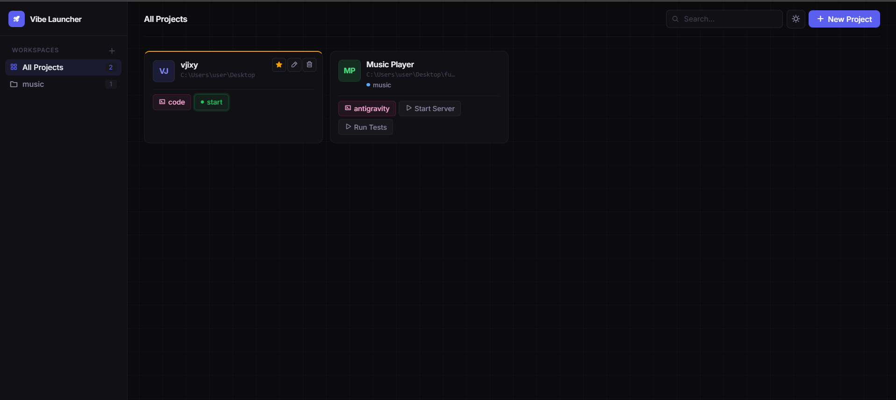

<div align="center">



<br/>
<br/>

# Vibe Launcher

**A lightweight local launcher for all your vibe-coded apps.**  
Centralize every project, run commands, and open your IDE — all from one clean UI.

<br/>

[](https://www.npmjs.com/package/@vjixy/vibel)
[](https://www.npmjs.com/package/@vjixy/vibel)
[](LICENSE)
[](https://nodejs.org)

<br/>

</div>

---

## What is Vibe Launcher?

If you vibe-code a lot, you end up with dozens of projects scattered across your machine. Vibe Launcher gives every project a permanent home — a local web dashboard where you can launch servers, open editors, and organize everything by category without touching the terminal.

No cloud. No account. Just a single `vibel` command.

---

## Features

| | |
|---|---|
| 🗂️ **Category workspaces** | Group projects into custom categories. Create and delete them from the sidebar. |
| ▶️ **One-click run** | Define multiple named commands per project. Each runs in its own terminal window. |
| 🛑 **Stop running processes** | Kill any running command directly from the UI. |
| 🖥️ **IDE launcher** | Open any project in VS Code, Cursor, Windsurf, or any CLI editor. |
| 📌 **Pin favorites** | Pin important projects to always float to the top of the grid. |
| 🌗 **Light & dark mode** | Toggle themes. Preference saved across sessions. |
| 🖱️ **Drag to reorder** | Rearrange the project grid by dragging cards. Order is persisted. |
| 📝 **Project notes** | Add free-text notes to any project, shown as a preview on the card. |
| 🔍 **Live search** | Instantly filter across project names, paths, categories, and notes. |

---

## Installation

### Global install (recommended)

Install once, run from anywhere:

```bash
npm install -g @vjixy/vibel
```

Then start it:

```bash
vibel
```

Open **[http://localhost:3000](http://localhost:3000)** in your browser.

---

### Local / development

```bash
git clone https://github.com/vjixy/VibeLauncher.git
cd VibeLauncher
npm install
npm start
```

---

## Usage

1. Click **New Project** in the top-right corner.
2. Fill in the **project name**, **absolute path**, and **IDE command** (`code`, `cursor`, `windsurf`, …).
3. Add one or more **run commands** — give each a short label (e.g. `frontend`, `backend`).
4. Assign one or more **categories** from the searchable dropdown, or create a new one inline.
5. **Save** — your project card appears in the grid.

From the card you can:
- **▶ Run** any command — opens a new terminal window in the project directory.
- **■ Stop** a running command.
- **Open in IDE** — one click.
- **Pin** the project to keep it at the top.
- **Drag** to reorder.
- **Edit / Delete** via the hover action buttons.

To create a new category without adding a project first, click the **+** button next to *Workspaces* in the sidebar.

---

## Project structure

```
VibeLauncher/
├── public/
│   ├── index.html      # Single-page UI
│   ├── style.css       # Design system & component styles
│   └── app.js          # Client logic, multi-select, drag & drop
├── server.js           # Express API + command execution
├── projects.json       # Local database (auto-created, gitignored)
├── package.json
└── README.md
```

Data is stored locally in `projects.json` alongside `server.js`. No database, no cloud, no telemetry.

---

## Tech stack

- **Runtime** — Node.js
- **Server** — Express
- **Frontend** — Vanilla HTML + CSS + JavaScript (zero build step)
- **Icons** — [Phosphor Icons](https://phosphoricons.com/)
- **Fonts** — [Inter](https://fonts.google.com/specimen/Inter) via Google Fonts

---

## Requirements

- **Node.js** v16 or later
- **Windows** (command execution uses `cmd.exe` — macOS/Linux support planned)

---

## License

[ISC](LICENSE)

---

<div align="center">
  Built for fast, creative development workflows.
</div>
